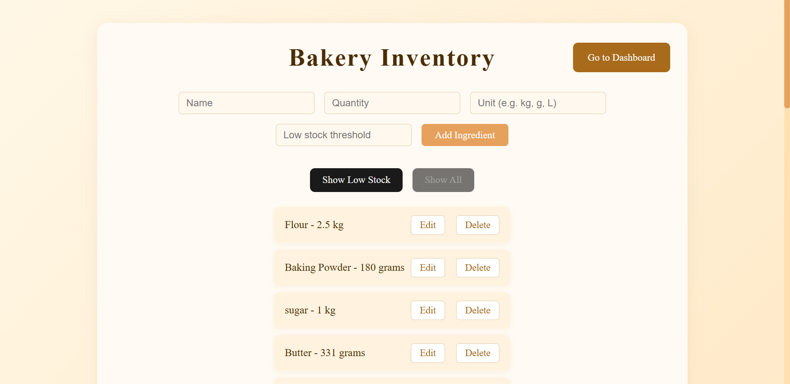
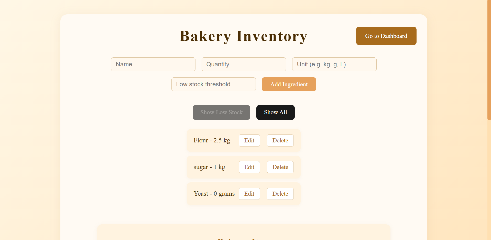
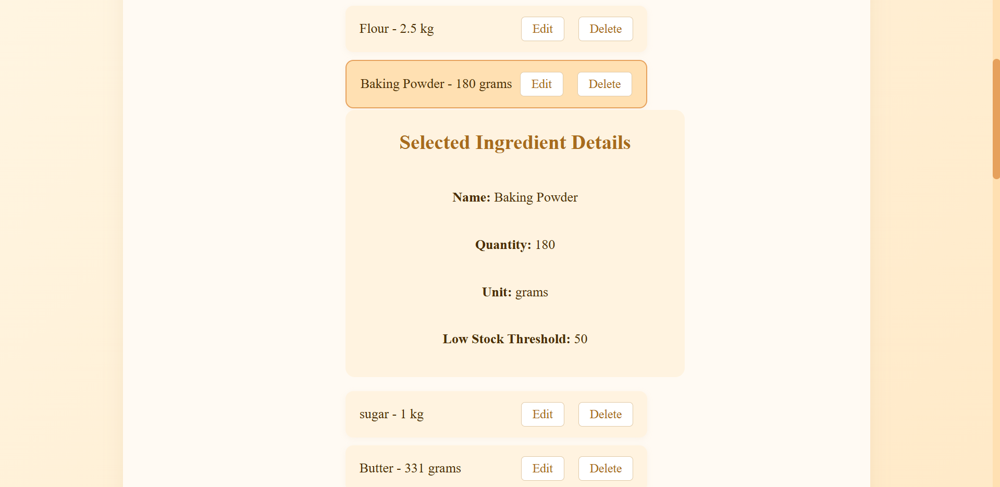
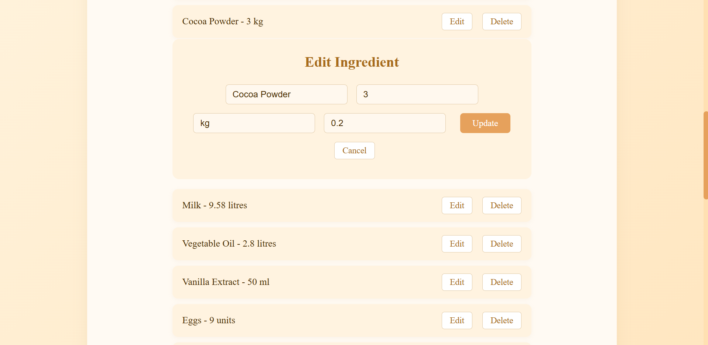
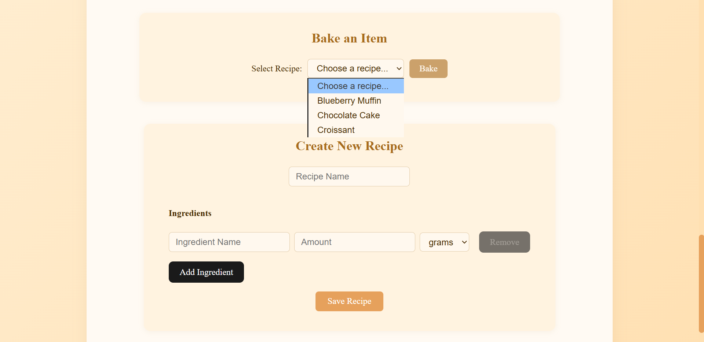
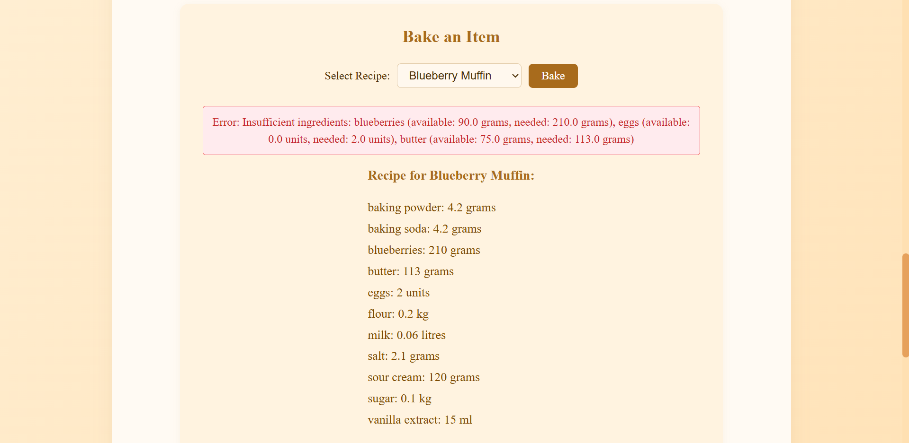
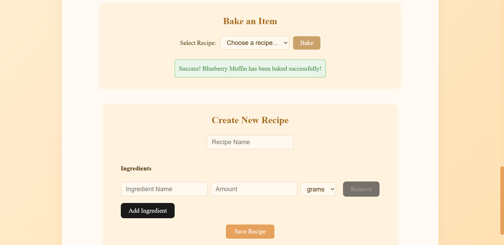
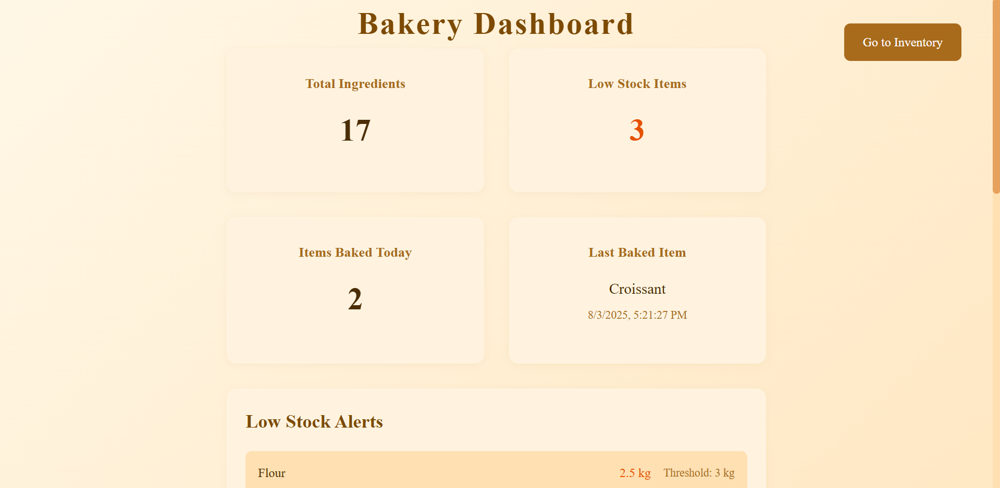
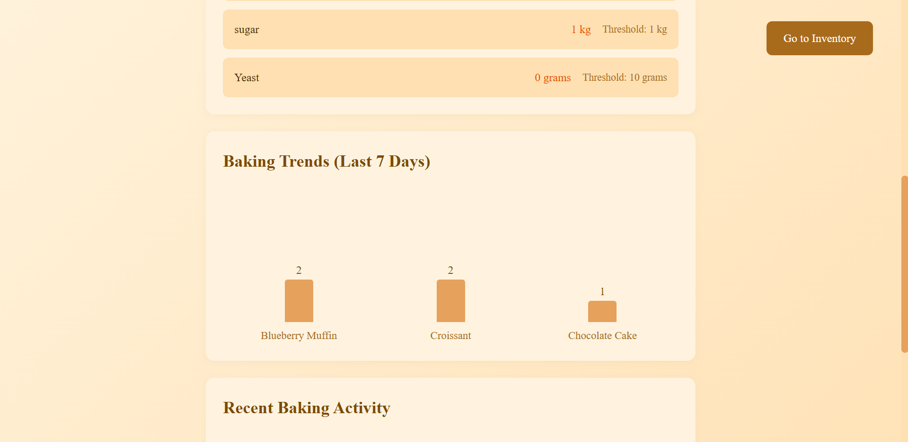
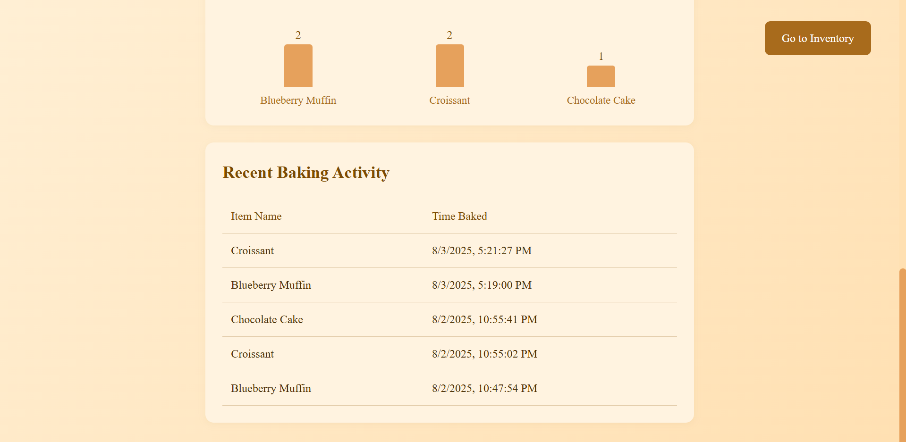

# 🧁 Small-Business-Bakery-Inventory-System

A full-stack inventory management system tailored for small home bakeries. Built with **Flask** for the backend and **React** for the frontend, this app helps bakers manage ingredients, track baking history, monitor low-stock items, and store and define recipes with precision.

## 🍰 Features
- ✔️ View, add, and edit ingredients (with quantity and unit)
- ✔️ Track ingredient stock and highlight low-stock items
- ✔️ Bake items from predefined (saved) recipes (auto-subtracts ingredients from stock)
- ✔️ Create and manage recipes dynamically
- ✔️ View baking history (timestamped logs)
- ✔️ A dashboard overview with quick insights (total ingredients, low-stock items, items baked today, last baked item, baking trends and recent baking activity)
- ✔️ Persistent data storage using local JSON files

## ⚙️ Tech Stack
- **Frontend:** React + Vite + Tailwind CSS
- **Backend:** Flask (Python) + Flask-CORS
- **Persistence:** JSON files (`data/`, `history/`, `recipes/`)
- **Dev Tools:** Cursor, Git, VS Code, WSL (Ubuntu), GitHub

## 📦 Project Structure
```
Small-Business_Bakery_Inventory_System/
├── app/         # Flask backend
│ ├── app.py     # Main backend logic
│ ├── data/      # Ingredient data JSON
│ ├── history/   # Baking history JSON
│ └── recipes/   # Recipes JSON
├── frontend/    # React frontend
│ ├── src/
│ ├── public/
│ └── ...
├── venv/        # Virtual environment (ignored in Git)
├── .gitignore
└── requirements.txt # Python dependencies
```

## 🧪 How to Run Locally
```bash
### 1. Clone the Repository
git clone https://github.com/siyonaaa/Small-Business-Bakery-Inventory-System.git
cd Small-Business-Bakery-Inventory-System

### 2. Setup the Backend (Flask)
python3 -m venv venv
source venv/bin/activate           # or venv\Scripts\activate on Windows
pip install -r requirements.txt
cd app
python app.py

### 3. Setup the Frontend (React)
cd frontend
npm install
npm run dev
```
## 🙌 Acknowledgements
Built with love to support small business owners and home bakers.

## ✨ End-Product

- The Landing Page


- The Inventory Page: View all your current ingredients in stock


- Filter the list to show only the current items running low in stock


- Select an ingredient to see its details


- Edit an ingredient's details


- Record what you're about to bake based on your previously defined recipes or add a new recipe


- Alerts you if you try to bake an item which uses ingredients that are currently low in stock


- When you successfully bake an item


- The Dashboard Page



